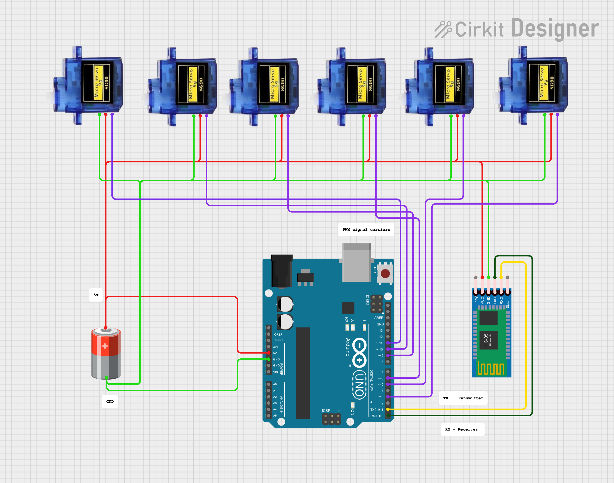

# Bionic Arm

# Watch Full Breakdown on Youtube 
[](https://youtu.be/ba7aIu2IH8I)

# 🦾 IoT-Based Bionic Hand — ESP32 + Blynk

> A low-cost, remotely controlled bionic hand that mimics human hand gestures using servo motors, nylon strings acting like tendons, and IoT control via the Blynk platform.

---

## 📖 Overview

This project demonstrates a cost-effective, IoT-enabled bionic hand built with an ESP32 microcontroller. Each finger is actuated by a servo motor pulling a nylon tendon, and the hand is controlled in real-time via a smartphone through the Blynk IoT platform over WiFi.

---

## 🧰 Components

### Hardware
| Component | Purpose |
|---|---|
| ESP32 Devkit V1 | Main microcontroller (Wi-Fi + Bluetooth) |
| Servo Motors (×6) | One per finger + lateral thumb motion |
| Nylon Strings | Act as tendons to curl fingers |
| Elastic Strings | Act as muscles to extend fingers back |
| External Power Bank | Powers servos without overloading ESP32 |
| 3D-Printed Hand Frame | Physical structure of the hand |
| Jumper Wires + Breadboard | Electrical connections |
| HC-05 Bluetooth Module *(optional)* | Short-range offline control |

### Software
| Tool | Purpose |
|---|---|
| Arduino IDE | Programming the ESP32 |
| ESP32Servo Library | ESP32-compatible servo control |
| Blynk IoT Platform | Mobile app interface for real-time control |

---

## ⚡ Circuit & Wiring



---

## ⚙️ Working Principle

Each finger is driven by a dedicated servo motor:
1. **Curl** — Servo rotates, pulling the nylon tendon, curling the finger
2. **Extend** — Servo releases, elastic string pulls finger back to open position

The Blynk app sends button/slider signals to the ESP32 over WiFi. The ESP32 decodes these into servo angle commands using virtual pins (V0–V18).

---

## 📱 Blynk Virtual Pin Map

| Virtual Pin | Function |
|---|---|
| V0 – V5 | Individual servo control (Thumb → Pinky + Palm) |
| V10 | Open all fingers |
| V11 | Close all fingers (grip) |
| V12 | Thumbs up 👍 |
| V13 | Show 1 finger ☝️ |
| V14 | Show 2 fingers ✌️ |
| V15 | Show 3 fingers 🤟 |
| V16 | Show 4 fingers 🖐 |
| V17 | Spiderman 🕷️ |
| V18 | Toggle Ambient Mode (wave animation) |

---

## 💻 Code

```cpp
#define BLYNK_TEMPLATE_ID "YOUR_TEMPLATE_ID"
#define BLYNK_TEMPLATE_NAME "Hand Control"
#define BLYNK_AUTH_TOKEN "YOUR_AUTH_TOKEN"

#include <WiFi.h>
#include <WiFiClient.h>
#include <BlynkSimpleEsp32.h>
#include <ESP32Servo.h>

char ssid[] = "YOUR_WIFI_SSID";
char pass[] = "YOUR_WIFI_PASSWORD";

Servo servo[6];
bool ambientMode = false;

int servoPins[6]   = { 13, 12, 14, 27, 26, 25 };
int openAngles[6]  = {  0,  0, 180,  0, 180,  0 };
int closeAngles[6] = { 180, 100, 100, 110, 90, 180 };

void runAmbientMode() {
  int sequence[] = { 1, 3, 4, 5, 0, 2 }; // Pinky → Ring → Middle → Pointer → Thumb → Palm
  for (int i = 0; i < 6 && ambientMode; i++) {
    servo[sequence[i]].write(closeAngles[sequence[i]]);
    delay(300);
  }
  delay(500);
  for (int i = 5; i >= 0 && ambientMode; i--) {
    servo[sequence[i]].write(openAngles[sequence[i]]);
    delay(300);
  }
  delay(500);
}

void setup() {
  Serial.begin(115200);
  Blynk.begin(BLYNK_AUTH_TOKEN, ssid, pass);
  for (int i = 0; i < 6; i++) {
    servo[i].attach(servoPins[i]);
    servo[i].write(openAngles[i]);
  }
}

// Individual finger control
BLYNK_WRITE(V0) { servo[0].write(param.asInt()); }
BLYNK_WRITE(V1) { servo[1].write(param.asInt()); }
BLYNK_WRITE(V2) { servo[2].write(param.asInt()); }
BLYNK_WRITE(V3) { servo[3].write(param.asInt()); }
BLYNK_WRITE(V4) { servo[4].write(param.asInt()); }
BLYNK_WRITE(V5) { servo[5].write(param.asInt()); }

// Open / Close all
BLYNK_WRITE(V10) { for (int i = 0; i < 6; i++) servo[i].write(openAngles[i]); }
BLYNK_WRITE(V11) { for (int i = 0; i < 6; i++) servo[i].write(closeAngles[i]); }

// Gesture presets
BLYNK_WRITE(V12) { int g[] = {  0, 100, 180, 110,  90, 180 }; for (int i=0;i<6;i++) servo[i].write(g[i]); } // 👍
BLYNK_WRITE(V13) { int g[] = {180, 100, 100, 110,  90,   0 }; for (int i=0;i<6;i++) servo[i].write(g[i]); } // ☝️
BLYNK_WRITE(V14) { int g[] = {180, 100, 100, 110, 180,   0 }; for (int i=0;i<6;i++) servo[i].write(g[i]); } // ✌️
BLYNK_WRITE(V15) { int g[] = {180, 100, 100,   0, 180,   0 }; for (int i=0;i<6;i++) servo[i].write(g[i]); } // 🤟
BLYNK_WRITE(V16) { int g[] = {180,   0, 100,   0, 180,   0 }; for (int i=0;i<6;i++) servo[i].write(g[i]); } // 🖐
BLYNK_WRITE(V17) { int g[] = {  0,   0, 180, 110,  90,   0 }; for (int i=0;i<6;i++) servo[i].write(g[i]); } // 🕷️
BLYNK_WRITE(V18) { ambientMode = param.asInt(); }

void loop() {
  Blynk.run();
  if (ambientMode) runAmbientMode();
}
```

---

## 🚧 Challenges & Solutions

| Challenge | Solution |
|---|---|
| Default Servo library incompatible with ESP32 | Switched to `ESP32Servo.h` |
| ESP32 brownouts when powering servos directly | Powered servos from an external power bank |
| HC-05 Bluetooth limited to short range | Switched to WiFi + Blynk for full IoT capability |
| Ground conflicts between ESP32 and servos | Ensured a shared common ground across all components |

---

## 📊 Results

- ESP32 connected successfully to WiFi and Blynk cloud
- Real-time servo actuation in response to app inputs
- Successfully performed: grip, release, individual finger movement, and gesture presets
- System stability: **~70% program memory**, **~14% dynamic memory** used

---

## 🔮 Future Enhancements

- **Force Sensors** — Fingertip feedback for grip strength awareness
- **AI Gesture Recognition** — Camera + ML model for gesture-based control
- **Battery Optimization** — Improved efficiency for prosthetic use
- **Cloud Logging** — Firebase / ThingSpeak for usage analytics
- **Voice Control** — Google Assistant / Alexa integration

---

## 🛠️ Setup & Getting Started

1. Install [Arduino IDE](https://www.arduino.cc/en/software) and add ESP32 board support
2. Install libraries: `ESP32Servo`, `Blynk` (via Library Manager)
3. Create a new Blynk template and get your **Auth Token**
4. Replace placeholders in the code:
   ```cpp
   #define BLYNK_TEMPLATE_ID "YOUR_TEMPLATE_ID"
   #define BLYNK_AUTH_TOKEN  "YOUR_AUTH_TOKEN"
   char ssid[] = "YOUR_WIFI_SSID";
   char pass[] = "YOUR_WIFI_PASSWORD";
   ```
5. Upload the sketch to your ESP32
6. Configure the Blynk app with sliders (V0–V5) and buttons (V10–V18)
7. Power up and control! 🤖

---

## 📄 License

This project was created for educational purposes. Feel free to build upon it!
