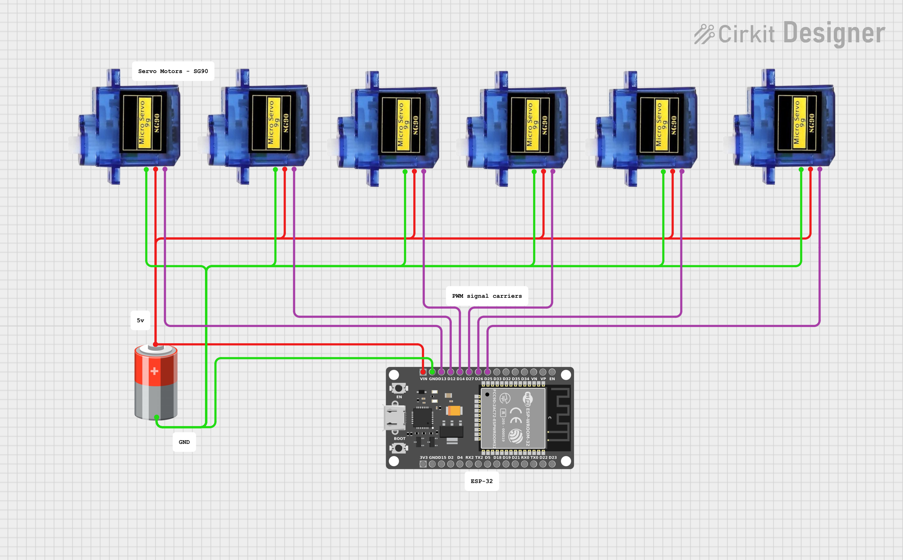

# Bionic Arm

# 🦾 IoT-Based Bionic Hand — ESP32 + Blynk

> A low-cost, remotely controlled bionic hand that mimics human hand gestures using servo motors, nylon strings acting like tendons, and IoT control via the Blynk platform.

## 📖 Overview

This project demonstrates a cost-effective, IoT-enabled bionic hand built with an ESP32 microcontroller. Each finger is actuated by a servo motor pulling a nylon tendon, and the hand is controlled in real-time via a smartphone through the Blynk IoT platform over WiFi.

---

# Watch Full Breakdown on Youtube 
[](https://youtu.be/ba7aIu2IH8I)

---

## 🧰 Components

### Hardware
| Component | Purpose |
|---|---|
| ESP32 Devkit V1 | Main microcontroller (Wi-Fi + Bluetooth) |
| Servo Motors (×6) | One per finger + lateral thumb motion |
| Nylon Strings | Act as tendons to curl fingers |
| Elastic Strings | Act as muscles to extend fingers back |
| External Power Bank | Powers servos without overloading ESP32 |
| 3D-Printed Hand Frame | Physical structure of the hand |
| Jumper Wires + Breadboard | Electrical connections |
| HC-05 Bluetooth Module *(optional)* | Short-range offline control |

### Software
| Tool | Purpose |
|---|---|
| Arduino IDE | Programming the ESP32 |
| ESP32Servo Library | ESP32-compatible servo control |
| Blynk IoT Platform | Mobile app interface for real-time control |

---

## ⚡ Circuit & Wiring



---

## ⚙️ Working Principle

Each finger is driven by a dedicated servo motor:
1. **Curl** — Servo rotates, pulling the nylon tendon, curling the finger
2. **Fold** — Besides the 5 servos for each of the fingers, a 6th servo controls the thumbs lateral motion
3. **Extend** — Servo releases, elastic string pulls finger back to open position

The Blynk app sends button/slider signals to the ESP32 over WiFi. The ESP32 decodes these into servo angle commands using virtual pins (V0–V18).

[]
(https://raw.githubusercontent.com/Toj-0477/Bionic_Arm/main/assets/Final_Display_Product.mp4)
---

## 📱 Blynk Virtual Pin Map

| Virtual Pin | Function |
|---|---|
| V0 – V5 | Individual servo control (Thumb → Pinky + Palm) |
| V10 | Open all fingers |
| V11 | Close all fingers (grip) |
| V12 | Thumbs up 👍 |
| V13 | Show 1 finger ☝️ |
| V14 | Show 2 fingers ✌️ |
| V15 | Show 3 fingers 🤟 |
| V16 | Show 4 fingers 🖐 |
| V17 | Spiderman 🕷️ |
| V18 | Toggle Ambient Mode (wave animation) |

---

## 🚧 Challenges & Solutions

| Challenge | Solution |
|---|---|
| ESP32 brownouts when powering servos directly | Powered servos from an external power bank |
| Nylon strings tend to wear quickly due to friction | Doubled and ran them through thin plastic straws |
| Weak 3D printed joints | Bolted them |

---

## 🔮 Future Enhancements

- **Force Sensors** — Fingertip feedback for grip strength awareness
- **Haptic Sensors** — To relay texture, temperature, pressure details
- **AI Gesture Recognition** — Camera + ML model for gesture-based control
- **Battery Optimization** — Improved efficiency for real prosthetic use
  
---

## 🛠️ Setup & Getting Started

1. Install [Arduino IDE](https://www.arduino.cc/en/software) and add ESP32 board support
2. Install libraries: `ESP32Servo`, `Blynk` (via Library Manager)
3. Create a new Blynk template and get your **Auth Token**
4. Replace placeholders in the code:
   ```cpp
   #define BLYNK_TEMPLATE_ID "YOUR_TEMPLATE_ID"
   #define BLYNK_AUTH_TOKEN  "YOUR_AUTH_TOKEN"
   char ssid[] = "YOUR_WIFI_SSID";
   char pass[] = "YOUR_WIFI_PASSWORD";
   ```
5. Upload the sketch to your ESP32
6. Configure the Blynk app with sliders (V0–V5) and buttons (V10–V18)
7. Power up and control! 🤖

---

## 📄 License
This project was created for educational purposes. Feel free to build upon it!
